# Silent Scalper - A Serverless Data Processing Pipeline on AWS

<p align="center" style="font-size: 18px;">
    Owned and Maintained by <a href="https://github.com/jujubear24">Jules Bahanyi</a> 
</p>

This project is a complete, production-grade, serverless data processing pipeline built on Amazon Web Services (AWS). It solves the common business problem of efficiently handling unpredictable data workloads by automatically scaling resources, ensuring high availability, and operating on a cost-effective pay-per-use model.

The entire infrastructure is managed as code using Terraform, and the backend is supported by a full CI/CD pipeline with automated testing using GitHub Actions. The project is complete with a modern Next.js frontend for data visualization and interaction.

**Live Demo:** <https://main.d27mjzbws6y41f.amplifyapp.com/>

## 1. The Business Problem

Companies that manage data in the cloud often face two critical, opposing challenges:

1. **Wasted Costs**: Provisioned servers sit idle during periods of low traffic, burning money without providing value.

2. **System Failures**: Sudden traffic spikes overwhelm under-provisioned systems, leading to crashes, data loss, and poor user experience.

The **"Silent Scalper"** pipeline is designed to eliminate this trade-off. It provides a robust architecture that can sit dormant at near-zero cost, yet instantly scale to handle massive influxes of data without manual intervention.

## 2. Architecture

This project is built on a robust, event-driven architecture using core AWS services. The entire infrastructure is managed declaratively using Terraform (Infrastructure as Code).

```mermaid
---
config:
  theme: neutral
---
flowchart LR
  %% ========================
  %% Frontend & User Interaction
  %% ========================
  subgraph Frontend["🌐 User / Frontend"]
    A["User via Browser / Amplify"]
    NextJs["Next.js Dashboard"]
    I["User via Frontend"]
  end

  A -->|1. Upload File| NextJs
  NextJs -->|2a. Fetch Records| J
  NextJs -->|2b. Request Upload URL| J
  NextJs -->|2c. Request Download URL| J
  I -->|7. Request Data| J

  %% ========================
  %% Backend & Data Ingestion
  %% ========================
  subgraph Backend["📥 Data Ingestion & Processing"]
    B["S3: Incoming Bucket"]
    C["Lambda: File Processor"]
    D["DynamoDB: Processed Data"]
    E["S3: Quarantine"]
    F["CloudWatch Alarms"]
    G["SNS Topic"]
    H["Administrator / Email Notification"]
    UploadLambda["Lambda: Uploader"]
    DownloadLambda["Lambda: Downloader"]
    K["Lambda: Records Reader"]
    J["API Gateway"]
  end

  %% User uploads
  A -->|Direct Upload via Presigned URL| B
  B -->|Triggers| C
  C -->|Write Record| D
  C -->|On Error| E
  C -->|Logs| F
  F -->|On Error| G
  G -->|Notify| H

  %% API / Data Retrieval
  J -->|GET /records| K
  K -->|Scan Table| D
  J -->|POST /uploads| UploadLambda
  UploadLambda -->|Generate URL| B
  J -->|GET /downloads| DownloadLambda
  DownloadLambda -->|Generate URL| B
  K -->|Return JSON| J
  J -->|Return Data| I

  %% ========================
  %% CI/CD Pipeline
  %% ========================
  subgraph CICD["⚙️ CI/CD (GitHub Actions)"]
    Dev["Developer"]
    GitHub["GitHub Repo"]
    Workflow["GitHub Actions Workflow"]
    Test["Run Unit Tests"]
    Deploy["Terraform Deploy"]
    AWS["AWS Resources"]
  end

  Dev -->|Push to main| GitHub
  GitHub -->|Triggers| Workflow
  Workflow --> Test --> Deploy
  Deploy -->|Updates| AWS

  %% ========================
  %% Styling
  %% ========================
  style A fill:#f9f,stroke:#000,stroke-width:2px,color:#D50000
  style I fill:#f9f,stroke:#333,stroke-width:2px,color:#D50000
  style NextJs fill:#ffe0b2,stroke:#333,stroke-width:1.5px,color:#D50000
  style B fill:#ccf,stroke:#333,stroke-width:1.5px,color:#D50000
  style C fill:#cfc,stroke:#333,stroke-width:1.5px,color:#D50000
  style D fill:#ccf,stroke:#333,stroke-width:1.5px,color:#D50000
  style E fill:#ccf,stroke:#333,stroke-width:1.5px,color:#D50000
  style F fill:#ffc,stroke:#333,stroke-width:1.5px,color:#D50000
  style G fill:#ffc,stroke:#333,stroke-width:1.5px,color:#D50000
  style H fill:#f9f,stroke:#333,stroke-width:2px,color:#D50000
  style J fill:#cfc,stroke:#333,stroke-width:1.5px,color:#D50000
  style K fill:#cfc,stroke:#333,stroke-width:1.5px,color:#D50000
  style UploadLambda fill:#cfc,stroke:#333,stroke-width:1.5px,color:#D50000
  style DownloadLambda fill:#cfc,stroke:#333,stroke-width:1.5px,color:#D50000
  style Dev fill:#f9f,stroke:#333,stroke-width:2px,color:#D50000
  style GitHub fill:#ccf,stroke:#333,stroke-width:1.5px,color:#D50000
  style Workflow fill:#ffc,stroke:#333,stroke-width:1.5px,color:#D50000
  style Test fill:#cfc,stroke:#333,stroke-width:1.5px,color:#D50000
  style Deploy fill:#cfc,stroke:#333,stroke-width:1.5px,color:#D50000
  style AWS fill:#ccf,stroke:#333,stroke-width:1.5px,color:#D50000

  style Frontend color:#FF6D00
  style Backend color:#00C853
  style CICD color:#2962FF
```



## 3. Core Features

* **Serverless Architecture:** No servers to manage. The pipeline is composed of managed AWS services, leading to zero idle costs.

* **Event-Driven Processing:** An S3 file upload automatically triggers the entire data processing workflow.

* **Infrastructure as Code (IaC):** The entire cloud environment is defined declaratively using Terraform, ensuring consistent and repeatable deployments.

* **Automated CI/CD:** A GitHub Actions workflow automatically tests and deploys infrastructure changes on every push to the ```main``` branch.

* **Unit Testing:** The core business logic in the Lambda functions is validated by an automated unit testing suite using ```moto```.

* **Secure Data Access:** A REST API with API key authentication provides controlled access to the processed data.

* **Frontend Uploads & Downloads:** Users can securely upload and view files directly from the browser using S3 presigned URLs.

* **Robust Error Handling:** Failed files are automatically quarantined in a separate S3 bucket for manual inspection.

* **Automated Monitoring & Alerting:** A CloudWatch alarm monitors for Lambda errors and sends an email notification via SNS if anomalies are detected.

* **Modern Frontend:** A responsive dashboard built with Next.js, TypeScript, and Tailwind CSS displays the processed data.

## 4. Technology Stack

| Category | Technology |
|----------|------------|
|Infrastructure | Terraform, AWS|
| Compute |  AWS Lambda (Python) |
| Storage | AWS S3,  AWS DynamoDB |
| API | AWS API Gateway (REST API with API Key Auth) |
| Frontend | Next.js, React, TypeScript, Tailwind CSS |
|CI/ CD & Source Control | GitHub, GitHub Actions |
| Testing | Python, ```unitest```, ```moto``` |
|Monitoring and Alerting | AWS CloudWatch, AWS SNS |

## 5. Setup & Deployment

### Prerequisites

* [Terraform](https://developer.hashicorp.com/terraform/install) installed.

* [AWS CLI](https://docs.aws.amazon.com/cli/latest/userguide/getting-started-install.html) installed and configured with your AWS credentials.

* [Node.js](https://nodejs.org/en) (v18 or later) and npm installed.

* [Python](https://www.python.org/downloads/) installed

### Backend Deployment

1. **Clone the Repository**:

    ```bash
    git clone git@github.com:jujubear24/silent-scalper-aws.git
    cd silent-scalper-aws
    ```

2. **Navigate to the Infrastructure Directory**: 

    ```bash
    cd infrastructure
    ```

3. **Initialize Terraform**:

    ````terraform
    terraform init
    ```
4. **Deploy the Infrastructure**:

    ```terraform
    terraform apply
    ```

Confirm the deployment by typing yes. After completion, Terraform will output the api_endpoint_url.

### Frontend Setup

1. **Navigate to the frontend directory**:

    ```bash
    cd ../frontend
    ```

2. **Create Environment File**: Create a file named ```.env.local``` and add your API details:

    ```bash
    NEXT_PUBLIC_API_ENDPOINT=...your_api_endpoint_url_from_terraform...
    NEXT_PUBLIC_API_KEY=...your_api_key_from_the_aws_console...
    ```

3. **Install Dependencies and Run Locally**:

    ```bash
    npm install
    npm run dev
    ```
    Open <http://localhost:3000> in your browser.

### Unit testing

To run the automated tests for the Lambda functions locally:

1. **Navigate to the Lambda Directory:**

    ```bash
    cd ../infrastructure/lambda
    ```
2. **Install Test Dependencies (if not already installed):**

    ```python
    pip install boto3 moto
    ```

3. **Run the Tests:**

    ```python
    python -m unittest discover tests
    ```

## 6. Project Structure

The repository is organized as a monorepo to separate the infrastructure code from the frontend application code.

```
.

├── .github/workflows/      # CI/CD workflow definitions
│   └── terraform_deploy.yml
├── frontend/               # Next.js application
│   ├── src/
│   ├── .env.local          # (Must be created manually)
│   └── ...
├── infrastructure/         # Terraform configuration
│   ├── lambda/             # Lambda function source code
│   │   ├── api/
│   │   ├── tests/
│   │   └── process_file.py
│   └── main.tf
└── README.md
```

## 7. License

This project is licensed under the MIT License. See the LICENSE file for details.
